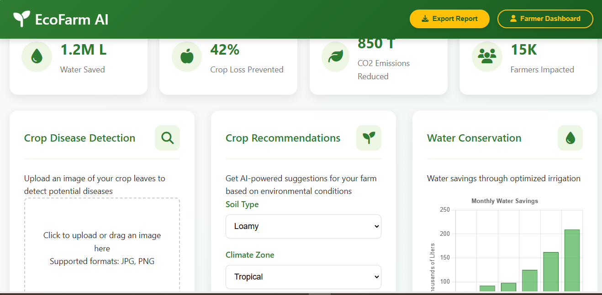

# 🌱 EcoFarm AI - Sustainable Farming Assistant

[](https://sdgs.un.org/goals/goal2)
[](https://sdgs.un.org/goals/goal13)


An AI-powered web application that helps small farmers optimize crop yields while reducing environmental impact, aligning with UN Sustainable Development Goals 2 (Zero Hunger) and 13 (Climate Action).



## Features

- **Soil Health Analysis**: AI-powered soil nutrient monitoring
- **Crop Disease Detection**: Image-based disease identification
- **Sustainable Recommendations**: Water/pesticide reduction tips
- **Responsive Design**: Works on mobile and desktop

## Technologies Used

- **Frontend**: HTML5, CSS3, JavaScript
- **AI Integration**: TensorFlow.js (ready for implementation)
- **Design**: Responsive layout with CSS Flexbox/Grid

## Getting Started

### Prerequisites

- Modern web browser (Chrome, Firefox, Edge)
- (Optional) Python/Flask backend for advanced features

### Installation

1. Clone the repository:
   ```bash
   git clone https://github.com/siqnax/ecofarm-ai.git 
   ```

2. Navigate to project directory:

```bash
cd ecofarm-ai
Open index.html in your browser
```


### Running the Demo

- Click "Run AI Analysis" for simulated soil health report

- Upload a crop image and click "Scan with AI" for disease detection

- View AI recommendations in the results section 

### Project Structure 
```
ecofarm-ai/
├── index.html          # Main application page
├── style.css           # Stylesheets
├── script.js           # Main application logic
├── assets/             # Image assets
│   ├── drone-icon.png
│   ├── soil-sensor.png
│   └── screenshot.png
└── README.md           # This file
``` 

### Future Enhancements
- Integrate with TensorFlow.js for real image classification

- Add IoT sensor data connectivity

- Implement user accounts for saving farm data

- Multi-language support for global farmers 

### Contact
Project Maintainer: [Francis] - siqnax@gmail.com

Project Link: https://github.com/siqnax/ecofarm-ai


